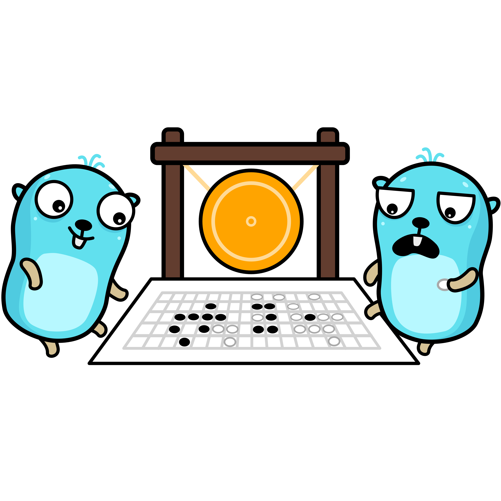

# gobase
automatic schema detection that creates the migrations for your code



## Goal
This is the goal for the gobase v0.0.1 

Input code:
```go
package main

import (
    "time"
)

type users struct {
    ID        int 
    CreatedAt time.Time 
    UpdatedAt time.Time 
    Name      string
    Email     string
    IsMember  bool
}
```

Output code:
```sql
CREATE TABLE users (
    id INT,
    created_at TIMESTAMP,
    updated_at TIMESTAMP,
    name TEXT,
    email TEXT,
    is_member BOOLEAN
);
```

## Milestones for gobase v0.0.1

- [x] Parsing the struct
- [x] SQLite table creation query generator
- [ ] Basic Table Creation
    - [ ] Connect to database
    - [ ] Create tables
    - [ ] Basic error handling
    - [ ] Simple CLI command
- [ ] Schema Management
    - [ ] Track schema state
    - [ ] Detect changes
    - [ ] Generate diff
- [ ] Migration System
    - [ ] Generate migration files
    - [ ] Execute migrations
    - [ ] Track migration state
- [ ] Complete CLI
    - [ ] All basic commands
    - [ ] Configuration handling
